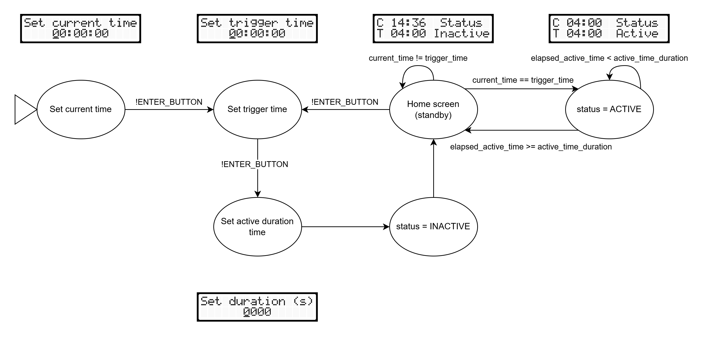

# Irrigation System

A simple 8051-based irrigation system for my garden.

## Installation

**1. System requirements**

  First, install the following tools:

- SDCC >= 4.2.0
- GNU Make >= 4.4.1
- avrdude >= 7.3 

**2. Hardware specific settings**

The `src/lib/global.h` file contains constants defined according to the suggested circuit, more specifically:

- Countdown timer register values

- Pins used for the LCD display and buttons

Feel free to edit them according to your circuit.

**3. Compilation**

To compile this application, simply run:

```sh
make
```

You will have a new folder named `build` created at the root of your project containing the resulting `main.hex` file.

**4. Flashing**

To flash your microcontroller connected to the `/dev/ttyUSB0` port through your programmer, execute:

```sh
make PORT=/dev/ttyUSB0 flash
```

**5. Suggested Circuit**

## Usage


